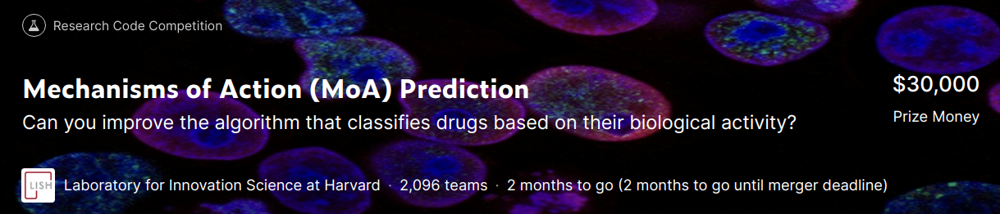

# kaggle-Mechanisms-of-Action-MoA-Prediction
Mechanisms of Action (MoA) Prediction コンペのリポジトリ

## Basics
### Overview(DeepL)
MITとハーバード大学ブロード研究所、ハーバード大学イノベーション科学研究所（LISH）、NIH Common Funds Library of Integrated Network-Based Cellular Signatures（LINCS）内のプロジェクトであるコネクティビティマップは、MoA予測アルゴリズムの改善を通じて医薬品開発を前進させることを目的に、この課題を提示しています。

医薬品の作用機序（MoA）とは何か？また、なぜそれが重要なのでしょうか？

過去には、科学者たちは天然物から薬を導き出したり、伝統的な治療法に触発されたりしてきました。米国ではアセトアミノフェンとして知られるパラセタモールのような非常に一般的な医薬品は、その薬理作用を駆動する生物学的メカニズムが理解される何十年も前に臨床使用されていました。今日では、より強力な技術の出現により、創薬は過去のセレンディピタス的アプローチから、疾患の基礎となる生物学的メカニズムの理解に基づいた、よりターゲットを絞ったモデルへと変化している。この新しい枠組みでは、科学者たちは病気に関連するタンパク質ターゲットを特定し、そのタンパク質ターゲットを調節できる分子を開発しようとします。特定の分子の生物学的活性を説明するための略語として、科学者たちは作用機序（mechanical-of-action）または略してMoAと呼ばれるラベルを割り当てます。

新薬のMoAはどのようにして決定するのでしょうか？

1つのアプローチは、ヒト細胞のサンプルを薬剤で処理し、次に、遺伝子発現のライブラリや既知のMoAを持つ薬剤の細胞生存率パターンなど、大規模なゲノムデータベースの既知のパターンとの類似性を検索するアルゴリズムを用いて細胞応答を分析することです。

このコンペでは、遺伝子発現データと細胞生存能データを組み合わせたユニークなデータセットにアクセスすることができます。このデータは、100種類の細胞タイプのプール内の薬剤に対するヒト細胞の反応を同時に（同じサンプル内で）測定する新技術に基づいています（このようにして、ある薬剤に対してどの細胞タイプがより適しているかを事前に特定するという問題を解決します）。さらに、このデータセットに含まれる5,000以上の薬剤のMoAアノテーションにアクセスできます。

恒例のように、データセットはテストとトレーニングのサブセットに分割されています。したがって、トレーニングデータセットを使用して、テストセットの各ケースを1つ以上のMoAクラスとして自動的にラベル付けするアルゴリズムを開発することがあなたの課題です。薬物は複数のMoAアノテーションを持つことができるので、このタスクは正式にはマルチラベル分類問題であることに注意してください。

解の精度を評価するには？

MoAアノテーションに基づいて、各薬剤-MoAアノテーションのペアに適用される対数損失関数の平均値に基づいて、ソリューションの精度が評価されます。

成功すれば、あなたは、その細胞署名を与えられた化合物のMoAを予測するアルゴリズムの開発に貢献し、科学者が創薬プロセスを前進させるのに役立ちます。

### Data Description(DeepL)
このコンテストでは、遺伝子発現データや細胞生存率データなどの様々な入力を与えられた異なるサンプル（sig_id）の作用機序（MoA）応答の複数のターゲットを予測します。

2つの注意点があります。

トレーニングデータには、テストデータには含まれず、スコアリングには使用されないMoAラベルの追加（オプション）セットがあります。
再実行データセットは、パブリックテストで見られる例の約4倍の数を持っています。

train_features.csv - 訓練セットの特徴量．cp_type は化合物（cp_vehicle）または対照摂動（ctrl_vehicle）で処理されたサンプルを示し、対照摂動は MoA を持たない。
train_targets_scored.csv - スコアされるバイナリMoAターゲット。
train_targets_nonscored.csv - 訓練データの追加の（オプションの）バイナリMoA反応。これらは予測もスコア化もされません．
test_features.csv - テストデータの特徴量．テストデータの各行のスコアされたMoAの確率を予測する必要があります．
sample_submission.csv - 正しい形式の提出ファイル．

### input
**shape**
|filename|shape|
|---|---|
|||

**train_fatures.cv**
shape: (23814, 876)
|columns|detail|
|---|---|
|sig_id|id|
|cp_type|hoge|
|cp_time|hoge|
|cp_dose|hoge|
|g-[0, 771]|hoge|
|c-[0, 99]|hoge|

## features
## Log
### 20201006
- join
- data download
- data size list

    |filename|file size|shape|
    |----|---|---|
    |sample_submission.csv|3.2M|(3,982, 207)|
    |test_features.csv|25M|(3,982, 876)|
    |train_features.csv|150M|(23,814, 876)|
    |train_targets_nonscored.csv|19M|(23,814, 403)|
    |train_targets_scored.csv|9.7M|(23,814, 207)|

- nb001
    - inputデータのEDAを行った

### 20201007
