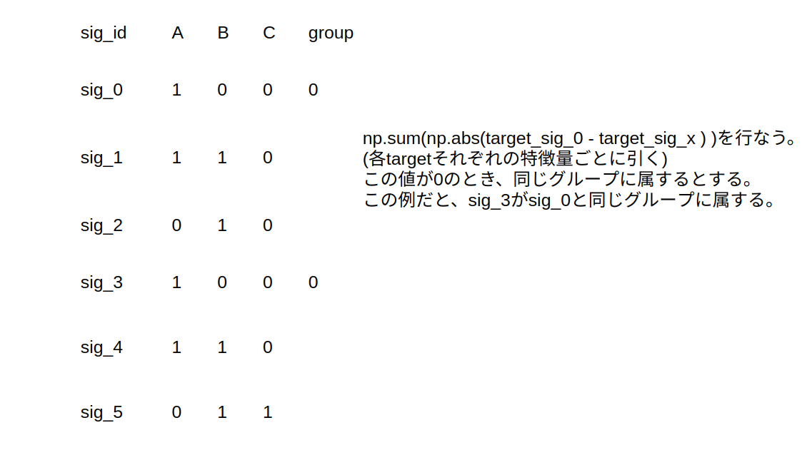
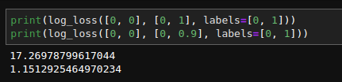

# kaggle-Mechanisms-of-Action-MoA-Prediction
[Mechanisms of Action (MoA) Prediction](https://www.kaggle.com/c/lish-moa/overview) コンペのリポジトリ


## Basics
Mechanism of Action(MoA)とは、薬剤がその薬理学的効果を発揮するための特異的な生化学的相互作用を意味する。 ([参考](https://ja.wikipedia.org/wiki/作用機序))

### info
- [googledrive](https://drive.google.com/drive/u/1/folders/1JGawvjsXcoTEVL_VHkRvE1J7-UclvA7u)
- [issue board](https://github.com/fkubota/kaggle-Mechanisms-of-Action-MoA-Prediction/projects/1)
- Important person

|name|detail|
|---|---|
|[mrbhbs](https://www.kaggle.com/mrbhbs/discussion?sortBy=latestPost&group=commentsAndTopics&page=1&pageSize=20)|ホスト。ドメイン知識に関するディスカッションのコメントによく現れる。|
|[Michael Maguire](https://www.kaggle.com/thawatt/discussion?sortBy=latestPost&group=commentsAndTopics&page=1&pageSize=20)|ホストに良い質問ぶつけてくれてるマスター。|

### Paper
|No.|Status|Name|Detail|Date|Url|
|---|---|---|---|---|---|
|01|Todo|TabNet: Attentive Interpretable Tabular Learning|TabNetの原論文|2020|[url](https://arxiv.org/abs/1908.07442)|
|02|Done|A novel method for classification of tabular data using convolutional neural networks|テーブルデータに対してCNNを使う手法TACの論文。|2020|[url](https://www.biorxiv.org/content/10.1101/2020.05.02.074203v1.full)|
|02|Todo|Focal Loss for Dense Object Detection|focal lossの原論文|2017|[url](https://arxiv.org/abs/1708.02002)|

### Overview(DeepL)
MITとハーバード大学ブロード研究所、ハーバード大学イノベーション科学研究所（LISH）、NIH Common Funds Library of Integrated Network-Based Cellular Signatures（LINCS）内のプロジェクトであるコネクティビティマップは、MoA予測アルゴリズムの改善を通じて医薬品開発を前進させることを目的に、この課題を提示しています。

医薬品の作用機序（MoA）とは何か？また、なぜそれが重要なのでしょうか？

過去には、科学者たちは天然物から薬を導き出したり、伝統的な治療法に触発されたりしてきました。米国ではアセトアミノフェンとして知られるパラセタモールのような非常に一般的な医薬品は、その薬理作用を駆動する生物学的メカニズムが理解される何十年も前に臨床使用されていました。今日では、より強力な技術の出現により、創薬は過去のセレンディピタス的アプローチから、疾患の基礎となる生物学的メカニズムの理解に基づいた、よりターゲットを絞ったモデルへと変化している。この新しい枠組みでは、科学者たちは病気に関連するタンパク質ターゲットを特定し、そのタンパク質ターゲットを調節できる分子を開発しようとします。特定の分子の生物学的活性を説明するための略語として、科学者たちは作用機序（mechanical-of-action）または略してMoAと呼ばれるラベルを割り当てます。

新薬のMoAはどのようにして決定するのでしょうか？

1つのアプローチは、ヒト細胞のサンプルを薬剤で処理し、次に、遺伝子発現のライブラリや既知のMoAを持つ薬剤の細胞生存率パターンなど、大規模なゲノムデータベースの既知のパターンとの類似性を検索するアルゴリズムを用いて細胞応答を分析することです。

このコンペでは、遺伝子発現データと細胞生存能データを組み合わせたユニークなデータセットにアクセスすることができます。このデータは、100種類の細胞タイプのプール内の薬剤に対するヒト細胞の反応を同時に（同じサンプル内で）測定する新技術に基づいています（このようにして、ある薬剤に対してどの細胞タイプがより適しているかを事前に特定するという問題を解決します）。さらに、このデータセットに含まれる5,000以上の薬剤のMoAアノテーションにアクセスできます。

恒例のように、データセットはテストとトレーニングのサブセットに分割されています。したがって、トレーニングデータセットを使用して、テストセットの各ケースを1つ以上のMoAクラスとして自動的にラベル付けするアルゴリズムを開発することがあなたの課題です。薬物は複数のMoAアノテーションを持つことができるので、このタスクは正式にはマルチラベル分類問題であることに注意してください。

解の精度を評価するには？

MoAアノテーションに基づいて、各薬剤-MoAアノテーションのペアに適用される対数損失関数の平均値に基づいて、ソリューションの精度が評価されます。

成功すれば、あなたは、その細胞署名を与えられた化合物のMoAを予測するアルゴリズムの開発に貢献し、科学者が創薬プロセスを前進させるのに役立ちます。

### Data Description(DeepL)
このコンテストでは、遺伝子発現データや細胞生存率データなどの様々な入力を与えられた異なるサンプル（sig_id）の作用機序（MoA）応答の複数のターゲットを予測します。

2つの注意点があります。

トレーニングデータには、テストデータには含まれず、スコアリングには使用されないMoAラベルの追加（オプション）セットがあります。
再実行データセットは、パブリックテストで見られる例の約4倍の数を持っています。

train_features.csv - 訓練セットの特徴量．cp_type は化合物（cp_vehicle）または制御摂動（ctrl_vehicle）で処理されたサンプルを示し、制御摂動は MoA を持たない。cp_timeおよびcp_doseは、治療期間（24時間、48時間、72時間）および投与量（高値または低値）を示す。
train_targets_scored.csv - スコアされるバイナリMoAターゲット。
train_targets_nonscored.csv - 訓練データの追加の（オプションの）バイナリMoA反応。これらは予測もスコア化もされません．
test_features.csv - テストデータの特徴量．テストデータの各行のスコアされたMoAの確率を予測する必要があります．
sample_submission.csv - 正しい形式の提出ファイル．


### input

|filename|file size|shape|comment|
|----|---|---|---|
|sample_submission.csv|3.2M|(3,982, 207)|---|
|test_features.csv|25M|(3,982, 876)|このデータセットはpublicデータセットと完全に等しい。privateはpublicの4倍のサイズ。|
|train_features.csv|150M|(23,814, 876)|---|
|train_targets_nonscored.csv|19M|(23,814, 403)|---|
|train_targets_scored.csv|9.7M|(23,814, 207)|---|

**train_fatures.cv**
- shape: (23814, 876)
- cpはcompoundの略っぽい

|columns|detail|
|---|---|
|sig_id|薬の種類|
|cp_type|化合物で処理されたのか、制御摂動で処理されたのかを示す。cp_vehicl or cp_ctrlの二値を取る。制御摂動(cp_ctrl)はMoAを持たない。|
|cp_time|処理時間。24, 48, 72の3値を取る。|
|cp_dose|投与量。D1, D2(high, low)の2種類。|
|g-[0, 771]|signify gene expression data. mRNAのデータ。|
|c-[0, 99]|signify cell viability data. 細胞の生存率を表す。|

## features

## Log
### 20201006
- join
- data download
- data size list


- nb001
    - inputデータのEDAを行った

### 20201007
- 今日はkaggle日記にinputを追加。
- この[EDA](https://www.kaggle.com/isaienkov/mechanisms-of-action-moa-prediction-eda)ノートブックを読んだ。

### 20201008
- 銀河さんのいつもの[イケイケEDA](https://www.kaggle.com/headsortails/explorations-of-action-moa-eda)みてた。
    - Treatment features

        
    
    - Target
        - MoAが同時に活性になっている数

        
        
    - 各クラスでアクティブになってる数(n_sample=23,814)
        - 最大800以上
        - 最小1

        

### 20201010
#### チームマージした日！！
チーム名は、**May the CV be with you.** になった！


### 20201011
- cool_rabbit さんからいろいろドメイン知識を学ばせてもらった。([slack](https://moagold.slack.com/archives/C01D1R2KCV6/p1602308954001100))
- cool_rabbitさんから教えてもらった[実験の論文](https://www.cell.com/cell/fulltext/S0092-8674(17)31309-0?_returnURL=https%3A%2F%2Flinkinghub.elsevier.com%2Fretrieve%2Fpii%2FS0092867417313090%3Fshowall%3Dtrue)
- cool_rabbitさんからホストがやりたいことを教えてもらった。おもったより簡単だった...

    ```
    ホストが開発した未来の薬剤候補(id)がたくさんあって、これらが既存の207種類の薬の中の何個の働きを持つかを知りたいわけです。
    ```
- cool_rabbitさんから得たとメイン知識をslideでまとめた
    - [googleslide](https://docs.google.com/presentation/d/1TyYxMozqOpxq0v212EIk8PLh53fdQ84AEM41otwAHvQ/edit#slide=id.g9c253d643f_0_348)
- ひらゆきさんとNicoNecoさんが参考にしている[公開ノートブック](https://www.kaggle.com/nicohrubec/pytorch-multilabel-neural-network)をベースにしよう

### 20201012
- ベースラインの基礎としたい[公開ノートブック](https://www.kaggle.com/nicohrubec/pytorch-multilabel-neural-network/data?select=iterative-stratification-master)を見てた。
    - かなりシンプルで勉強しやすい。

- メンバーとpublicとprivateについて議論した。以下に[マインドマップ](https://drive.mindmup.com/map/1VMY-xOHTmjxZNqZdbZeo1aQIs_2-DPcL)でまとめた。
    - localのtest = publicのtest っぽいな...。本当か？

    

- TASSANとにこ猫さんと議論した。nonscoredを使うときは、以下のようにすべきという見解になった。

    

### 20201013
- ひらさんから教えてもらったMultilabelStratifiedKFoldがoverfitしやすいという[ディスカッション](https://www.kaggle.com/c/lish-moa/discussion/181340)

- domain知識溜まりそうな[discussion](https://www.kaggle.com/c/lish-moa/discussion/184005)

    - PGE2とLTB4は分子(targetのどれか)で、CREBがg-xxxのどれかに相当する。
    - ATPからCREBまで続く回路がある
    - CREBまでいくとある遺伝子が発現する
    - 薬剤の投与で、この回路そ促進または、阻害することができる
    - PGE2がEP2に反応？すると、CREBの遺伝子発現が促進される
    - 逆にLTB4がBLT1に反応すると回路を阻害するため遺伝子発現は抑制される
    - つまり、CREBなどの遺伝子発現を観測することで、PGE2やLTB4のどれが働いたのかが関節的にわかる。

    

    - cp_timeに関して
        - 72時間経過すると、薬剤はその効果を失う可能性がある。つまり、コントロールと区別がつかない場合がある。
    - 手元にあるtestデータは、publicのデータセットに等しい。
        - privateのデータセットは完全に未知。

- dataに施した前処理は、quantile normalizationだけではないらしい。([discussion](https://www.kaggle.com/c/lish-moa/discussion/184005#1034211))

- cool_rabbitさんに質問(コントロール群について)
    - (fkubota)ctl_vehicleは薬剤を投与していないという認識なのですが正しいですか？
    - (cool_rabbit)DMSOという薬液(濃度が薄ければ細胞には無害とされている)を投与していると思われます。
    - (fkubota)DMSOは6パターン(time3パターン x dose2パターン)あればいいのでは?
    - (cool_rabbit)理由はおそらく2つあって、
        - 同じ量と時間でも実験するたびにばらつきがあるので複数回する必要がある
        - 本物の薬剤候補を使って実験する時は、同時に同じプレートにコントロールを置く必要がある
        後者に関して、例えば晴天の日にtreatment群をやって、雨天の日にcontrol群をしてしまうと、未知の天気の影響が実験に出るかもしれないですよね。なので必ず同じ日に同じプレート内でコントロールを置く必要があります。ただしコントロールの数を薬剤と同じ数ほどは用意しなくてもいいので、例えば薬剤10種類とDMSO1つを同じプレート内の異なる11個の穴で同時に実験しているイメージです。

### 20201014
- [このディスカッション](https://www.kaggle.com/c/lish-moa/discussion/184005#1034211)で、quantile normalizationについて言及している
    - qn されていれば、ユニークな値になるはす。しかしなっていない。
    - ホストはqnしていると[コメント](https://www.kaggle.com/c/lish-moa/discussion/180390#1000307)している。
- sklearnのメトリックlog_lossはある(targetの)カラム全てに0が入っているとエラーが出る仕様になっている。
    - 以下のように自分で定義すればよさそう。
        ```python
        def log_loss_metric(y_true, y_pred):
            loss = - np.mean(np.mean(y_true * np.log(y_pred) + (1 - y_true) * np.log(1 - y_pred), axis = 1))
            return loss
        ```
    
- ぼーっとEDAしてた。
    - 最大値最小値を-10~10に正規化してるけど、min_max_scalerじゃなくて、サチュレイトさせてるっぽいんだよなー。  

      

    こんなアイデアおもしろいのでは？  
      

### 20201015
- cool_rabbitさんのアイデア(leak を避ける方法)
    - target の総数でグループ分けする

- 上の手法だと、たかだか12種類程度にしかわけることができないらしい。
    - しかもimbalanced...

- ちょっと問題整理してみよう。
    - 以下の図はすべて違う薬剤だが、sumだと縮退してしまう。見た目でわかるということはユニークな値にできるはず...

      


- 打開策思いついた！！

    |1|2|3|
    |---|---|---|
    |   |   |   |

- nb003
    - 上のアイデアを参考にノートブックを作成。
    - チームメイトにも展開した。
    - 特に間違ってなさそう。
    - グループは696個形成された。ただし、1グループ1sig_idというのも存在している。もう少しEDAしてみたほうがいいかもしれない。
    - analysis
        - trt_cpのみに絞ってgroupカラムでvalue_countsを行った。(group=1がall_target=0となる)
            - 1はやはり多い。

              

- TASSANの意見。たしかにそうだな...

    ```
    あるtargetが1つのfoldに集約すると以下のような問題点が起きると思います。
    ２fold分割、target1がfold1のみに存在し、testを推論する状況を考えます。
    １．fold1がtrain, fold2がvalidのとき、testのtarget1を予測する
    →問題なし(この予測とtest1とする)
    ２．fold2がtrain, fold1がvalidのとき、testのtarget1を予測する
    →fold2(trainデータ)にtarget1が存在しないのでこの予測にほとんど意味がなく、
    予測値がほぼ0になると思われる(この予測をtest2とする)
    このときに一般的にはtest1とtest2を行(sig_id)ごとに平均したものをsubmitに使うと思うのですが、
    そうすると予測値がほぼ0のものが必然的に混ざってしまい、あまりよろしくない予測になってしまうのでは？という懸念があります。
    極端の場合、１でtestのtarget1をほぼ間違いなく当てられるようなモデルを作ったとしても
    submitの際に予測値がほぼ0になってしまう２が混ざってしまうので、target1の予測精度が悪化するということが考えられます。
    (この場合の対処は簡単で、testのtarget1の予測には１で作ったモデルの推論のみを使う事が考えられます)
    以上が気を使ったほうが良いと言った具体的な内容です(完全に説明不足でした
    ```

- ホスト側の視点にたって考えてみた。
    ```
    ちょっとホスト側の気持ちになって考えてみたのですが、
    ABC=100
    ABC=010
    ABC=110
    のようなパターンがtrainには入っており、

    trainにはないパターン
    ABC=001
    がtestにある場合は考えられますよね？

    206のターゲットカラムの内、2つが1になる組み合わせ206C2=21115パターンあり、
    おそらくtrainで全ては網羅していないと思っています。(ましてや、3つが1になる組み合わせとなると...)
    それに同じ薬剤効果しかみつけられないモデルというのはホストは望んでいないのではないでしょうか。

    我々はむしろ、
    ABC=100
    ABC=010
    を学習して
    ABC=110
    を予想できるようなモデルをつくらなければいけないのではないかと考えました。
    参考までに。
    ```
    - TASSANからは同意をもらえた:)

- 現状の整理
    ```
    いろいろごちゃごちゃしてきたので、一旦整理させてください。
    僕がコメントしたこちらの思想のもとであれば、
    今の所、以下の課題があるにせよ696グループ分けが最善っぽい？という認識でいいでしょうか？
    
    課題
    - all_target = 0 のサンプルが極端に多い([https://moagold.slack.com/archives/C01D1R2KCV6/p1602818235291300?thread_ts=1602812717.288100&cid=C01D1R2KCV6)
    - 同じグループに異なる薬剤が入っている(できればなんとかして分けたいが、リークのリスクがある)
    - grupKFoldした時に、trainとvalidに同じ薬剤効果パターンが現れない(しかし、上記思想のもとでは問題にしなくてもいいかもしれない)
    - あるターゲットを見たときに、そのターゲットしか1にならない(他の205ターゲットは0)場合が極端に多いときに、
      fold間でそのターゲットの極端な不均衡が生まれてしまう。(TASSANの意見を追加)

    メリット
    - リークの問題からは開放されたはず。
    - リークの問題から開放される手法の中では今の所最も微細な構造をもつグループである。

    僕は、この認識です。
    ただ、思想の部分はまだ議論の余地はあるとは思っています。
    同意でも反論でもいいのでみなさんと認識を合わせたいです。
    よろしくおねがいします。
    ```

### 20201017
- cool_rabbitさんからのお告げ
    ```
    以下はそのGroup内の一部のsig_idで細胞殺傷能力が高い(cで-10近くの値)ものです。
    ・G1: MoAなし
    ・G10: dna_inhibitor
    ・G23: pdgfr_inhibitor
    ・G33: pi3k_inhibitor
    ・G34: sodium_channel_inhibitor
    ・G42: topoisomerase_inhibitor
    ・G124: serine_threonine_kinase_inhibitor
    ・G169: protein_synthesis_inhibitor
    ・G173: alk_inhibitor
    ・G189: atpase_inhibitor
    ・G201: selective_estrogen_receptormodulator(serm)
    ・G225: topoisomerase_inhibitor+rna_synthesis_inhibitor
    ・G328: proteasome_inhibitor
    ・G364: aurora_kinase_inhibitor+mek_inhibitor
    ・G374: exportin_antagonist
    ・G377: estrogen_receptor_antagonist
    ・G444: stat_inhibitor
    ・G451: apoptosis_inhibitor
    ・G471: flt3_inhibitor+jak_inhibitor
    ・G513: cyclooxygenase_inhibitor+lipoxygenase_inhibitor+nfkb_inhibitor+histone_acetyltransferase_inhibitor
    ・G584: apoptosis_stimulant+bcl_inhibitor+ikk_inhibitor+nfkb_inhibitor+nitric_oxide_production_inhibitor+nrf2_activator+ppar_receptor_agonist+glutathionereductase(nadph)_activators+heme_oxygenase_activators+reducing_agent
    ・G634: na_k-atpase_inhibitor
    ・G637: flt3_inhibitor+kit_inhibitor+pdgfr_inhibitor+vegfr_inhibitor+ret_inhibitor
    逆にこれら以外のGroupは細胞殺傷能力は弱〜中程度でした。
    ```

- ドメイン知識を得るのに重要な[discussion](https://www.kaggle.com/c/lish-moa/discussion/191487)
    - めっちゃ質問しまくってる。


### 20201018
- 鬼滅の刃 10冊読んでしまった。
- 面白かったから良しとする。


### 20201019
- nb002
    - とりあえず5-foldでコード書いた。
    - ただ、KFoldで5分割しただけなので、薬剤リークが存在する。
    - result
        - cv: 0.015140
        - loss

          

### 20201020
- nb002の後半で、log_lossの挙動見てたけど、結構えぐい。後処理考えないとなー。

      

- kagglenb001
    - nb002のモデルを使う
    - result
        - cv:  0.015140
        - sub: 0.01910

- nb004
    - targetの情報を用いてgroupを作成する
    - nb003では、696個にグルーピングした。
    - all_target = 0 のグループがかなり多いのでそれを細かく分割しようと思う。
    - get_696_strategy_fold(group, n_splits) という関数を作成した
    - get_696_strategy_fold
        - group_0とgroup_not0分ける
        - gourp_0を5fold, group_not0をgroup5foldする
        - fold情報を合体させる


- nb005
    - nb004で作成した、get_696_strategy_foldを使用した
    - result
        - n_splits = 5
        - cv: 0.024645

### 20201021
- kagglenb002
        - nb005で作成したモデルを使用
        - result
            - cv:  0.024645
            - sub: 0.02057

- nb006
    - nb005のcvが良くなかったので、その解析を行なう
    - おそらく、foldごとにtargetの分布差が生じているものだと思われる。
    - それを一定にするような方法を考える。
    
    - 任意のtargetが1になる回数を各fold毎にプロット

          

    - 上記の図をbinary化

          

    - 各targetがgroupに出現する回数を数えた
        - 悲報: 206のターゲットの内、`88`はある一つのグループに属していることがわかった。

    - [このディスカッション](https://www.kaggle.com/c/lish-moa/discussion/191857)からわかったのは、trainとtestに同じ薬剤が含まれている可能性があるということ。
        - 例
            - group330に属する薬剤は1サンプルだけ。
            - 1薬剤につき最低6回は測定するはずなので残りの5回はどこへ？
            - クオリティの問題で除外
            - 残りはすべてtestへ
            - 1,2の両方
        - つまり、薬剤リークはきにしなくていいってこと？
            - 話し合った結果その通りっぽい。
        
    - kfoldを行った
        - 任意のtargetが1になる回数をfold毎に計算した　
        - fold毎にtargetの総数が0になっている部分の可視化
            - おもったよりひどくないが、黒い部分をなくしたい

              

    - multi-stratified-kfoldを行った
        - fold毎にtargetの総数が0になっている部分の可視化
            - かなりいい感じ

              
        
        - 黒い部分が残ってるが、そもそもサンプルが1つしかない
            - atp-sensitive_potassium_channel_antagonist
            - erbb2_inhibitor  

              


### 20201022
- 現在1位の人が行ったことのまとめ[ディスカッション](https://www.kaggle.com/c/lish-moa/discussion/183377)
    - 個々に書いてあること全部試したい。
- ひらさんから教えてもらったLBとCVの乖離が大きい時の汎用的な対処法[discussion](https://www.kaggle.com/c/lish-moa/discussion/190949)

- TASSANが教えてくれた[disucussion](https://www.kaggle.com/c/lish-moa/discussion/191135)
    ```
    これは、atp-sensitive_potassium_channel_antagonistとerbb2_inhibitor
    (どちらもtarget=1のものが1行しかない)について
    全部0埋めした場合と0.000012埋めした場合のpublic scoreを比較した
    discussionなのですが、かなり差が開いてますね...
    ```

- TASSANの解析
    - なぜか、48D1だけ大きな値を取っている。

          


- nb007
    [ポイントは2つ]

    - あるターゲットは1になる回数が1回しかないデータがある--->学習に使えなさそう--->subの時には、そのターゲット列を定数で提出(例えば0とか)することを考えたほうがいい。
    - loglossの敏感さ-->例えば、3982中3コだけ1の列が合った時に、0で埋めるのと0.001で埋めるのでは、4倍程度lossの値が変わります。(それぞれ0.026021と0.006204)

    これらを考慮し、定数で埋める場合の適切な値を見積もってみました。
    trainに1つだけあるということは、残りの5つはtestにあるということになります。
    さらにpublicとprivateで別れますので、publicでは1~5のサンプルが1を取ることになりそうです。
    下のようなイメージです。

    例) publicのあるtarget col に3つだけ1が入っている場合。
    0010110000000...000000
    上記のようなパターンが実現されている場合、どの定数で満たすべきか？というのが今回の問題になります。
    一番簡単な例で言うと、0で満たす例です。0.1でもいいですし、1でもいいです。
    これをあらゆるパターンで計算してみたのが以下の最初の図です。
    拡大したのが2番目の図です。
    - 色の違いは、publicのサンプル数3982の内、何個が1になるかの違いです。1,2,3,4,5の5本あります。
    - 横軸は、一定値を低い方から高い方に変化させています。log spaceで等間隔で値を計算させています。そのため横軸のスケールも対数です。
    - 縦軸がloglossを示しています。
    結果としては、3982中5個が1なら0.0013程度、1個が1なら0.00024程度の値を一定値としてsubするともっとも良いスコアが出るとの結果が出ました。

          

          


- kagglenb003
    - nb002のモデルを使用
    - nb007の後処理を適用
    - 1回しか1にならないターゲット２つの値を0.0005で埋めて提出
    - result
        - びみょーーー
        - そもそも対象のターゲットの予測値が小さな値、0.0005に近い値を取っていたのであまり変化がなかった。
        - cv: 0.015140
        - sub(後処理ナシ): 0.01910
        - sub(後処理アリ): 0.01909

### 20201023
- const埋めについての[discussion]
    - `atp-sensitive_potassium_channel_antagonist` と `erbb2_inhibitor` が1になるサンプルが一つしかないので、定数で埋めるという作戦。
    - 0埋めの場合: 0.2055
    - 0.000012埋めの場合: 0.02004

### 20201024
- nb008
    - -9.8未満が含まれている割合(%)ランキング

          

    - 1位

          
    
    - -9.8未満を指数分布に置き換えた例

          
    
    - add_exp_noise関数を作成
        - lowとhighの処理合わせても、数秒程度で終わる
    

### 20201026
- nb009
    - nb008のadd_exp_noise関数を使う
    - result
        - cv: 0.015140
        - cv(nb002): 0.015191
        - 悪くなってるからボツ

### 20201027
- tableでNNを使う方法について簡単に調べた　
    - [tabnetの論文](https://arxiv.org/pdf/1908.07442.pdf)
    - table dataを画像にしてCNNを使用する[論文](https://www.biorxiv.org/content/10.1101/2020.05.02.074203v1.full)
    - domain知識に大事な[discussion](https://www.kaggle.com/c/lish-moa/discussion/193363)

- nb010
    - nb002のモデルを使って後処理を考える
    - 0.3~0.7の値を持つ場合、valに置き換えてみた
        - original logloss = 0.0151359400333833
          

        - 悪くなってますね。
        - いくつか試してみたけど良くなってるような感じはしなかった
    - target==1の時のoofの分布を見てみた。そもそもどうなってるんやろか。

        - nはtarget==1の個数 
        - 理想は1にピークがある構造
        - nが小さいほど、0に近い分布になってしまっている=学習がうまくいっていない

          

    - じゃあtarget==1の個数が小さい部分について対処すればいいのか？と思って各カラムでloglossを見てみた
        - 横軸:  あるtarget columnのの tartget==1になる数
        - 縦軸:  そのtargetのlogloss

          

        - グラフで見ると、target==1になる数が小さいほど、lossは小さかった...
            - target==1になる数が小さいtargetは学習がうまくいかない。
            - しかし、そもそも0に近い値を出力しておけばloglossは低い値を取る。(1の数が少ないので)
            - n target==1 が非常に少ないものはうまく学習ができないから対策とらないといけないと思ってたけど、全然対策しなくてよさそう...

### 20201028
- TACの論文読んでた。
    - まだ全然できてない。

### 20201029
- cool_rabbitさんとのディスカッション
    - 結果として、z-scoreの計算でカラム間の大小に意味がないことがわかった。
    - z-score = (Xi - med(X))/σ

          

- NikoNekoさんがSmoothBCEWithLogitsLossを入れただけでものすごいスコアの変化をしたとの報告があった
    - ↓のNoはspread sheetの番号
    -  result
        - [url](https://www.kaggle.com/kazuki123/new-baseline-pytorch-moa?scriptVersionId=45879239)
        - No10: cv=0.014206789	LB=0.01848
        - No19: cv=0.01442165399	LB=0.01831
    
- cool_rabbitさんが気になってる[discussion](https://www.kaggle.com/c/lish-moa/discussion/193878)

### 20201030
- nb011
    - target==0の数が多いcolと少ないcolで分けて学習した
    - result
        - 結果は悪くなった...理由がわからん。
        - cv(original): 0.015140141106353578
        - cv(threshold): 0.015442511864467509 

          


### 20201031
- paper02を読んでた。理解した。
    - やりたいこと: tableデータに対して、CNNを使いたい。
    - 手順
        1. base imageを用意する(何でも良い)
        2. 25次元の特徴量を5x5のフィルタにする。
        3. base imageに対して、2で作ったフィルタで畳み込む。
        4. 1~3をレコード全てに対して行い、そのレコード数に応じた画像を得る。
        5. この画像に対してCNNを持ちいてトレーニングする。

          

### 20201101

- nb012
    - nb002の改良　
    - `MultiStratifiedKFold` と `BCEWithLogitsLoss` を追加
    - result
        cv: 0.015070
        cv(nb002): 0.015140

- nb013
    - nb012の改良
    - SmoothLogitsLoss(smoothing=0.001)を導入
    - result
        - cv: 0.015192
        - cv(nb012): 0.015070
        - cv(nb002): 0.015140

        |BCEWithLogitsLoss|SmoothLogitsLoss|
        |---|---|
        | | |

- チームでのディスカッション
    - trainとtestで薬剤は違うだろうという話になった。　
    - 薬剤は違うが、MoAが同じものがあるのでしっかりそれを予測すればいい。


- kagglenb004
    - ニコ猫さんの[kagglenb](https://www.kaggle.com/kazuki123/new-baseline-pytorch-moa?scriptVersionId=45879239)を解析
        - このノートブックめっちゃスコア良い。
        - label smoothing入れたらlb良くなったみたい 
        - cv=0.01442165399	LB=0.01831

- kagglenb005
    - ニコ猫さんの[kagglenb](https://www.kaggle.com/fkubota/kagglenb005-from-nikoneko-san/edit)を解析
        - kagglenb004のlabel smoothingを抜いたバージョン
    - kagglenb004, 005の比較
        - 右上のsmooth_logits_loss はオレンジが２山になってる。
        - target=1と0の区別がついていない？

        |BCEWithLogitsLoss|SmoothLogitsLoss|
        |---|---|
        | | |

- nb014
    - nb012(original), nb013(label smoothing)の結果の比較
    - result
        - smoothing 入れると、広がるような感じが見られる

          
    
    - smoothingをさらに深ぼる。target=0の２山の原因を探りたいので、doseとtimeの依存を調べてみた。

        |smooth|dose|time|
        |---|---|---|
        |   |   |   |


- kagglenb006
    - nb012を提出
    - result
        - cv: 0.015070
        - LB: 0.01909
        - LB(kagglenb002): 0.02057
        - kagglenb002との違いは、MultiLabelStratifiedKFold、BCEWithLogitsLoss追加を行ったこと


### 20201102

- kagglenb007
    - nb013を提出
    - kagglenb006にlabel smoothing入れた感じ
    - result
        - cv: 0.015085
        - LB: 0.01888
        - LB(kagglenb005): 0.01909
    

### 20201103
- チームでのディスカッション(fkubota to cool_rabbit)

    ```
    そこなんですよねー。
    今回のモデルはほとんど学習できていないのでは？と思ってますwww
    賢いモデル=リスクを避ける だけになっていて、nが小さいモデルはほとんど0に近い予測値しかださないので
    ホストからするとnが大きなターゲット以外は使い物にならないだろうなと...
    そこで以下の図が大事になるのですが、
    横軸n, 縦軸loglossです。
    nが小さいとうまく学習できないので、0に近い予測ばかり出します。
    しかし、nが大きくなるにつれて0ばかり出しているとペナルティが大きくなります。
    なので0ばかり出しているモデルは自然と赤い矢印のような動きをします。
    しかし、オレンジ色の四角はそのトレンドから外れています。
    これらはおそらくうまく学習できています。
    ```

      


- nb015
    - nb013の改良
    - permutation importanceを実装
    - modelそのものに手は加えていない
    - result
        - なんか `c-65` と `c-98` がめっちゃいいんだが。
        - プラス側に突き抜けているやつはいなかった。
        - permutation importance はめっちゃ時間かかるからあまりやらないほうがいいかも。

              

- nb016
    - nb015のモデルを使ってtarget == 1の数が多いものと少ないものの解析を行なう

          

- nb017
    - nb017でやった解析を元に[スライド](https://docs.google.com/presentation/d/1qmadG6DIOe4P0Z7jLhqGeySW0fFB-VbkRSr74xKGClI/edit#slide=id.g9f5421c9e1_0_55)を作成した    

          

          

          

          

          

          


### 20201104
- **hostがtrain_drug.csv を公開した！！今更かい！！**
- 薬剤が公開されたのでfoldの切り方を考える。
    - いい感じの[ディスカッション](https://www.kaggle.com/c/lish-moa/discussion/195195)

- ホスト曰く「trainの薬剤はtestにも出現している」


### 20201105
- nb018
    - 新しく配られた`train_drug.csv`を見てみる。
    - value_countsしてみた。top8は何度も使われている

        |rank|drug_id|count|
        |---|---|---|
        |1|87d714366|     718|
        |2|9f80f3f77|     246|
        |3|8b87a7a83|     203|
        |4|5628cb3ee|     202|
        |5|d08af5d4b|     196|
        |6|292ab2c28|     194|
        |7|d50f18348|     186|
        |8|d1b47f29d|     178|
        |9|67c879e79|      19|
        |10|52d1e6f43|      18|
        |11|d488d031d|      18|

- TASSANがtestにどの程度入っているか計算していた

    - len(train_features) / len(test_features) = 23,814 / 3,982 = 5.98

        |rank|drug_id|count(train)|count(test)|count(train)/count(test)|
        |---|---|---|---|---|
        |1|87d714366|718|142|5.056|
        |2|9f80f3f77|246|14|17.571|
        |3|8b87a7a83|203|24|8.458|
        |4|5628cb3ee|202|19|10.632|
        |5|d08af5d4b|196|28|7|
        |6|292ab2c28|194|13|14.923|
        |7|d50f18348|186|22|8.454|
        |8|d1b47f29d|178|24|7.417|
        |9|67c879e79|19|-|-|
        |10|52d1e6f43|18|-|-|
        |11|d488d031d|18|-|-|


### 20201106
- nb019
    - focal loss を導入
    - [このソースを参考](https://github.com/andrijdavid/FocalLoss/blob/master/focalloss.py)
    - [focal lossの紹介](https://qiita.com/agatan/items/53fe8d21f2147b0ac982)
    - result
        - モデルの保存はgamma=0.5で行った
        - cv(gamma=0):0.015074
        - cv(gamma=0.1): 0.015195
        - cv(gamma=0.5): 0.015526
        - cv(gamma=1): 0.017204

        - loss
            - gamma>=0.5だと過学習が抑えられていることがわかる

            |gamma=0.1|gamma=0.5|gamma=1|
            |---|---|---|
            |   |  |  |

        - logloss

              

- kagglenb008
    - うーんだめだったか。
    - result
        - cv: 0.015526(gamma=0.5)
        - LB: 0.01916


- nb020
    - 以下の条件がそろったバリデーションを構築した
        - 薬剤リークがない
        - MoAの組み合わせを均等に分けたい(696グループ)
        - 各foldのデータ数を一定にしたい
        - 5fold
        - how to

            1. 696グループに分割
            1. あるグループiを選択
            1. グループi内MoAの組み合わせは同じだが、異なる薬剤が入っているのでそれらに1~5の番号を薬剤に割り振る
            1. i+1のグループ内の薬剤にも1~5に割り振るが1~5のfoldに割り当てられてるsig_idの総数の少ないものにsig_id数の多い薬剤を割り当てる(←数を調整する)
            1. i+2も同様
        
    - slackでチームメイトに向けて
        ```
        以前、MoAにかぶりがないように696グループに分けた際に、制限が厳しすぎるという話が出たかと思います。
        あまりにも厳しくて、各foldにtarget=1が割り振られないので学習がうまくすすまないという自体がありました。
        各ターゲットに最低でも1つは、1があるかを確かめたのが左の図です。
        黒いところが、そのfoldに1がないことになります。
        そして、今回、 薬剤が特定できるようになった ので、各グループを更に細分化できます。
        工夫した結果、あるグループ内の薬剤に1~5のfoldを割り振るかつ、各foldの数が同じ程度のデータ数になるようにしました。(notebook)
        その結果が真ん中の画像です。(ctrl,top8は除いています)
        かなり解消されています。
        改めてまとめると、以下の特性を有しています。
        • MoAのパターンが各foldにできるだけ分配されている
        • 薬剤リークを防いでいる
        • 各foldの数が均等になるようになっている(それぞれ、3968, 3966, 3965, 3965, 3961)
        ちなみに、何も考えずにdrug_idでGrupKFoldを行った場合が一番右の図です。
        結構黒い部分が目立ちます。
        図上: 696グループ
        図中: 今回の提案手法
        図下: drug_idのGroupKFold
        ```

          
          
          

### 20201107

### 20201108

### 20201109
